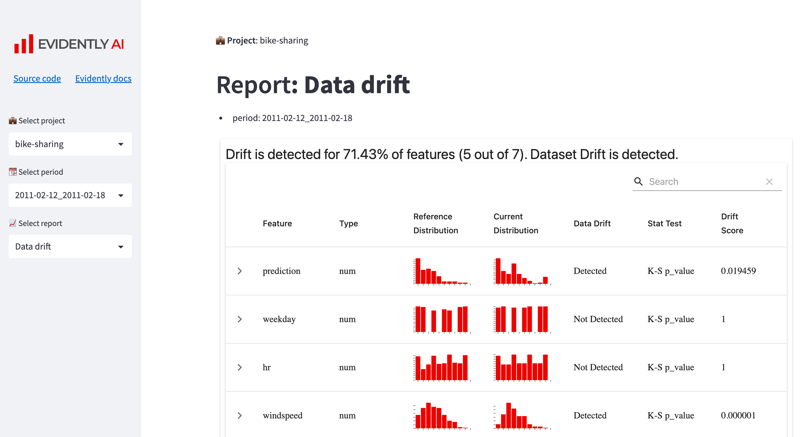

# ML monitoring dashboard with Evidently and Streamlit



**Note**: I've tested this example on macOS/Linux.

## 👩‍💻 Installation

### 1. Fork / Clone this repository

Get the evidently code example:

```bash
git clone git@github.com:fadhelmurphy/ML-Model-Monitoring.git
cd ML-Model-Monitoring

```

### 2. Create virtual environment

Note:

- it's recommended to use Python >=`3.9.12`
- the streamlit version`1.19.0` doesn't work with Python`3.9.7`

Create virtual environment named `.venv` and install python libraries

```bash
python3 -m venv .venv
source .venv/bin/activate
pip install -r requirements.txt
```

Set up Jupyter Notebook

```bash
python -m ipykernel install --user --name=evidently
jupyter contrib nbextension install --user
jupyter nbextension enable toc2/main
```

## 📺 Launch Monitoring Dashboards

Navigate to `streamlit-app/` directory and launch Streamlit application

```bash
cd streamlit-app 
streamlit run app.py
```

This command launches a local Streamlit server and the Monitoring Dashboard app will open in a new tab in your default web browser.

## ▶️ Generate monitoring reports with Evidently

Examples for Bike Sharing project

### 1. Run Jupyter Notebook

```bash
cd projects/bike-sharing
jupyter notebook
```

### 2. Generate new reports

- Open notebook`bicycle_demand_monitoring.ipynb`
- Run all cells to get predictions & generate Evidently reports

Notes:

- All Evidently reports (`.html` files) are stored in`reports/` directory in each project
